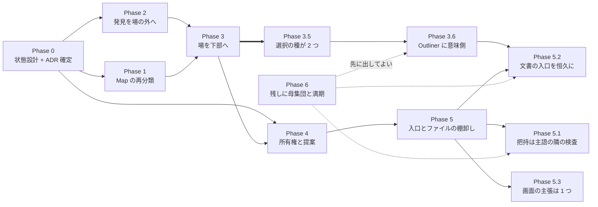

# 実装順序 (IA 再設計 段階「引き継ぎ」)

設計の逆順ではなく**土台から**。良いゾーン分割は良い開発分割になるので、
独立性の高いゾーンは後回しにできる。

正本の所在:

- **配置とその根拠** → `easy-extrude-wireframe-v8.html` の注釈①〜⑧ (最新版)
- **住所の物差しと却下した物差し** → `02-grouping-criteria.md`
- **設計判断** → **ADR-103** (Map の再分類 — Phase 1、実装済み) /
  **ADR-104** (所有権・提案・証憑 — Phase 4、実装済み) /
  **ADR-105** (発見の集約を場の外へ — Phase 2、実装済み) /
  **ADR-106** (場を下部へ・右端 280px スロットの退役 — Phase 3、**実装済み**) /
  **ADR-107** (選択の要素の種が 2 つになる — Phase 3.5、**実装済み**) /
  **ADR-111** (Outliner に意味側 — Phase 3.6、**Proposed**) /
  **ADR-108** (入口は動詞であって対象ではない — Phase 5、**実装済み**) /
  **ADR-110** (把持は主語の隣の検査 — Phase 5.1、**Proposed**) /
  **ADR-112** (文書の入口の住所を恒久に — Phase 5.2、**Proposed**) /
  **ADR-109** (残しに母集団と満期を — Phase 6、**Proposed**)
- **状態と基数** → `docs/STATE_LEDGER.md` §提案中の実体

**この表は段の全数である。** 起票済みの ADR で段を持たないものは 0 本でなければならない
— 段の無い ADR は「順序の外」ではなく**誰も実装しない ADR**になる。実際 ADR-107 は
Phase 3 の*帰結*として起票されたのに、この文書のどこにも現れないまま 1 度 commit された
(原則 #31 — *在る段*を辿る読み方では、無い段は出てこない)。

ここには**順序と、各段の完了条件**だけを置く (§1.1 — 複製しない)。

---

## Phase 0 — 状態を先に設計する (コードより前)

核 §1.4 の閾値を既に跨いでいる (提案・議題がそれぞれ 3 状態)。**クラスを書く前に**:

- [x] `docs/STATE_TRANSITIONS.md` に **提案** (`提案 → 承認 / 取り下げ`) と
      **議題** (`議題 → 決着 / 未決のまま閉会`) の節を起こす。guard と禁止遷移を列挙。
- [x] ADR-104 の**未解決 4 点**を決める → ADR-104 §未解決 4 点の決着 (U1〜U4)。
      **#1 は yes** (承認 = 主張更新 + 証憑記録の 1 undoable command)、#2 は楽観ロック
      guard で併存、#3 は新議題 + `supersedes`、#4 は記録時点の鍵集合を焼き込む。
- [x] ADR-103 / ADR-104 を Accepted へ。

**完了条件: 達成。** 不正状態が型で表現不能になる設計が図で描けている
(`stale` を状態にしない・`decidedBy ⊆ 決定時点の鍵集合`・終端からの復帰なし)。

## Phase 1 — Map の再分類 (ADR-103)

他のどの段にも依存しない**独立した削除**なので、最初に片付けると以降の見通しが良くなる。

- [x] `MapModeController.state.active` の撤去 → `PlaceToolController` へ再分類。
      描画状態 (`idle` / `drawing`) はツール状態として残った。
- [x] Lynch 5 種を `+ 追加` の **Place** グループへ。ヘッダの Map ボタンと Map ツールバー
      (`left:188px`) を削除。pan / wheel / pinch は OrbitControls へ返した。
- [x] 投影方式 (正射 / 透視) をギズモ直下のトグルへ。向きの入口はギズモのまま (足さない)。
      正射カメラは透視カメラからの**毎フレーム導出**にした (状態を持たない)。
- [x] 随伴更新: `STATE_LEDGER` (行の入れ替え + 負債 #1 と #3 を閉じる) /
      `STATE_TRANSITIONS` §Top-level Modes・§Place tool・§Projection /
      `SCREEN_DESIGN` S-14〜S-16 / `LAYOUT_DESIGN` / `CODE_CONTRACTS` 4 行 / `NAVIGATION`。

**完了条件: 達成。** トップレベルモードは 2 値で、`edit` かつ正射で真上から見られる
(e2e「正射のまま Edit Mode に入れる」が焼いている)。

## Phase 2 — 発見を場の外へ (最小で効果が最大)

現行の循環依存 (**場に入らないと場に入る必要があるかが分からない**) を断つ段。
権限も提案も要らないので、Phase 3 以降と独立に出荷できる。

**設計判断は ADR-105** (Proposed)。要点: カウンタの中身は ADR-104 D4 で既に正しく、
欠けているのは**住所**と**文書 0 件のときに何と言うか**である。ここには 0 が 3 種類ある
(未検証 / 検査対象なし / 全部パス) ので、kind 判別の union で割る。

- [x] ヘッダに 3 カウンタ (`≈ 衝突` / `⚑ 議題` / `◇ 未所有`)。衝突は導出値なので保存しない。
      描き手は `Chrome/DiscoveryCounters.jsx` へ出し、`ctx.active` を読まない。退出リデューサの
      `{0,0,0}` は消え、書き手は `contextSetDiscovery` **1 つ**になった。配線は場ではなく
      **文書の辺** (`contextLoaded` / `contextChanged`) — 場に入らない経路でも集約が生きる。
- [x] シーンスコープの KPI を 3D ビュー左上の HUD (`Chrome/SceneChecksHud.jsx`) へ。0 は
      `unexamined` / `none-declared` / `all-pass` / `failing` の 4 種として**宣言**する。
      `Checks` タブの `ctx.checks?.length > 0` 条件も外し、常設スロットにした (力学 4)。
- [x] エンティティスコープの検証を N パネル (選択物の隣) へ。**D5 の反証仮説のほうが正しかった**
      (ADR-105 §R1): 把持候補は選択駆動・文書不要で 1 クリック、リーチ / 干渉は*宣言された検査*
      なので同じ 4 種 union として述べる。可用性の軸は選択だけ (`ctx.active` も文書も読まない)。

**完了条件: 達成。** e2e 4 本が焼いている — 文書を採らずに「未検証」と読め (0 件ではなく)、
文書を採ると数へ変わり、場を閉じても数は変わらず、`robot_base` を選んで N パネルから
1 クリックで grasp のタブへ届く。ロボットでない実体では入口が**消えず**理由を運ぶ。

## Phase 3 — 場を下部へ / 右ドックの奪い合いを解く

**設計判断は ADR-106** (実装済み)。要点: 排他は**方針ではなく、住所の衝突の症状**だった。
同じ 1 つの衝突 (右端 `right:0` を 3 者が要求する) に、互いに知らない**3 つの回避策**が
当たっている — ずらす (`NPanel.jsx:33`) / 消す (`ContextController` の 7 箇所) /
被せる (`ContextLayer` の `zIndex:100` がギズモと投影トグルを隠す)。住所を変えれば、
回避策は**書く理由を失う**。

- [x] `ContextLayer` のタブ (定数 8 + 条件つき 3 = 最大 11 枚) を解体し、下部展開パネルへ。
      器に残るのは**「解消」と「その記録」の 2 種だけ** = 6 枚 (Matrix / Cluster / Floor /
      Questions / Why / Overview)。タブ列の `flex:1` を落とした — 器の形が中身の形に
      合ったので、幅の分母が 280 ではなく画面幅になった。3D は覆わない (`z:85`)。
- [x] N Panel と右ドックの排他を解消。**チュートリアルの Inspector (ADR-047) も同じ器へ**。
      排他 7 箇所 (`setNPanelVisible(false)` × 3 / `setForceHidden` × 4)・`inspectorOpen`
      シフト・`+280` 項がすべて消えた — **消したのではなく、書く理由が無くなった**。
      個数は `src/FloorContainerCensus.test.js` が構文から数える (母集団は
      `contextStart` / `contextEnd` を呼ぶメソッドから導出する呼び出し閉包なので、
      4 本目の入口が生まれても自動で入る)。
- [x] 入力系タブの移設。**Assets → `+ 追加` の Assets グループ** (スライダーは N パネル)、
      **Wizard / Intake → 文書の入口 (`DocIntakeLayer`)**。後者は**暫定住所**で、
      そのことを画面にも `view/DocIntake.js` にも書いた (宣言しない暫定は恒久になる)。
      3 つとも場から独立した — 入力は文書を要求するが、*交渉*は要求しない。
- [x] **下端の占有計算の所有者を先に置いた** (原則 #26 / `view/EdgeOccupancy.js`)。
      下端は占有物が積み重なるので段 (`BOTTOM_TIER`) の関数になり、未宣言の段では
      throw する。**先に置いたので剥がし残しが出なかった** — 逆に、置いた瞬間に
      既存のパッチが 2 個見つかった (Toast の `96px` は mobile でも同じ値、TourCard は
      原則 #26 をコメントで引用しながら literal を書いていた)。

**完了条件: 達成。** 右端の常設は N Panel 1 個 (構文から数えて 1)、
`_updateGizmoOffset()` は 2 項、排他の入口 0 個、退役タブ 0 個、下端の所有者 1 個。
e2e が「場を開いてもギズモ・投影トグル・N パネルが消えない」「器のタブは 6 枚で
出ていった 5 枚は無い」「移設先から到達できる」を焼いている。

**この段が引き受けなかったもの (宣言 — 消さずに残す):** ADR-107 は「Outliner の意味側
(v8 注釈②) は**未着手**で Phase 3 と同時に入れる」と書いて出荷したが、Phase 3 は器の
住所だけを扱い、**Outliner に意味側を足していない**。理由は器の移動と独立だからで
(意味側は「幾何の木の隣に文書の木を並べる」話であり、下端の占有とも排他とも関係が無い)、
Phase 3 に混ぜると 2 つの判断が 1 つの PR で不可分になる。

**この宣言は回収された (2026-08-04):** 「次にこれを拾う段は Phase 3.5 の延長として起票
すること」に従い、**ADR-111 / §Phase 3.6** として段を持った。宣言はここに残す — 消すと
「この項目は考えられたのか」が辿れなくなる (原則 #19 / `02-grouping-criteria.md` §未決と
同じ扱い)。なお**この項目が 2 回、散文でだけ宣言されて段を持たなかった**こと自体が
ADR-109 (残しに母集団と満期を) を起こした 4 つの実例のうちの 1 つである。

## Phase 3.5 — 選択の種が 2 つになる (ADR-107)

**実装済み (2026-08-02) — Phase 3 に先行して出した。** 順序を変えた理由は実装で
分かったことで、**変数を選ぶ窓 (場の行列の変数見出し) は今日の器の中に既に在った**
から: 器が下部へ移るのは「場と N パネルが*同時に*見える」ためであって、窓が生まれる
ためではない。先に出しておけば、器が動いた日に踏んだ人が回避策を書く余地が無い。

当初の判断は「Phase 3 と同じ PR か、その直後の PR で出す」だった。後回しにできない段である理由は、これが
Phase 3 の*前提条件*ではなく**帰結**だからである — 器を下部へ移すと場と N パネルが
**同時に見える**ようになり、「場で `d_ref` を選んでいる間、右パネルは誰のものか」が
**毎回起きる**。これまでこの問いが起こらなかったのは右パネルが場では消されていたから
であって、決着していたからではない (`ContextController` の排他がこの問いを隠していた)。

未決のまま Phase 3 を出すと、踏んだ人がその場で最小の回避策 (`selectedVariable` の
第二の選択状態) を書く。それは ADR-099 が消した「窓ごとに部分集合を書く」形の再生産で、
しかも既存の census は entity 側しか数えないので**割れたことに気づけない = 緑のまま壊れる**。

- [x] 選択を **kind 判別の有界 union** へ (`empty` / `entities` / `variables`)。
      `empty` は `entities` の要素数 0 ではなく**独立した第一の枝**。混在は型で表現不能。
- [x] **入口は 5 verb のまま** (ADR-099 D1)。Outliner の意味側・場の行列の列ヘッダ・
      未確定帯のクリックは**窓**であって入口ではない。`SelectionOwnership.test.js` の
      母集団の作り方を**変えずに**効き続けること — 作り直したら A 案を選んだ証拠。
- [x] 実体 id と文書 `ref` を同じ集合に混ぜない (名前空間を静的に区別 — 原則 #21 の同型)。
      `var:` 接頭辞のような命名規約に頼らない。
- [x] **種ごとの宣言表を 2 つ足す** — 3D の姿 (変数 = 未確定帯、ADR-050 の系譜) と
      N パネルの中身。どちらも**未宣言の種で throw** する (`EXPLICIT_DEFAULTS` /
      `PLACEMENT_BY_KIND` / `SUPPORT_SURFACE_BY_KIND` と同じ既定表の規律)。
      「今の 2 種は姿を持つ」は事実だが規則ではない。
- [x] 変数を選んでも文脈は消えない — 制約されている実体は `contextual` 軸の **DIMMED**
      で残る (ADR-096 / ADR-099 `_claimContext`)。**新しい語彙を足さない。**

**完了条件: 達成。** 場の行列の変数見出しから 1 クリックで変数が選べ、選択の種が
`variables` へ入れ替わり、右パネルの中身も入れ替わる (e2e 2 本)。入口は **5 verb のまま**で、
ADR-099 の census は**作り直さずに**通った (作り直しが要れば A 案の証拠だった)。
混在は `makeSelection` が throw するので構築経路 **0 個**、3D の姿を宣言していない
選択可能種 **0 個**、N パネルの種分岐は未宣言の種で throw する。変数側の
`FULL = 選択集合 ∩ 実体`(= ∅) / `DIMMED = 連鎖` を **N=25 で**焼いた。

実装で分かった精密化 2 点 (ADR-107 §実装で変わったこと): 3D の姿は種の中で **3 通りに割れ**
(領域 = 未確定帯 / スカラー = 束縛実体の DIMMED / どちらも無い = 0 を N パネルが述べる)、
Outliner の意味側 (v8 注釈②) は**未着手**。「Phase 3 と同時に入れる」と書いたが Phase 3 は
器の住所だけを扱ったので**まだ入っていない** — §Phase 3 の「この段が引き受けなかったもの」に
宣言として残してある (宣言しない未着手は、段を持たない ADR と同じで誰も実装しない)。
**2026-08-04 に段を得た** → §Phase 3.6 (ADR-111)。

## Phase 3.6 — Outliner に意味側を与える (ADR-111)

**設計判断は ADR-111** (Proposed)。要点: Phase 3.5 が選択の種を 2 つにした結果、
**選べるのにどのナビゲータにも載っていない実体** (`d_ref`) が生まれた。v8 注釈② が
仕様の正本で、そこには穴の理由まで書いてある — 文書の変数は意味の層の住人なので
住所は左のナビゲータであり、幾何の木ではない (体を持たないから)。

§Phase 3 の「この段が引き受けなかったもの」が指していた項目に、ここで段を与える。
**2 回、散文でだけ宣言されて段を持たなかった** — その事実自体が ADR-109 の実例 3 である。

- [ ] 左のナビゲータに幾何 ⇄ 意味の側。既定は幾何 (初期頻度 — v8 注釈②)。
- [ ] 意味側の住人は**共有変数だけ**から始める。actors / requirements は*選択できない*ので
      載せない (載せると「載っている ⊃ 選べる」が逆向きに崩れる)。
- [ ] 行のクリックは**窓**であって入口ではない — `selectOnly` を呼ぶだけで、
      ADR-099 の 5 verb は 5 のまま。
- [ ] 意味側の 0 を**最低 2 種**として宣言する (文書が無い / 文書に変数が 0 個)。
      1 つの「空」で両方を賄わない。
- [ ] `outliner.side` を `STATE_LEDGER` §提案中の実体へ。2 値・基数 1 なので
      状態機械は起こさない (閾値未満でも記録する)。

**完了条件:** 選択可能な種のうちナビゲータに住所を持たないものが **0 個** (母集団は
`SELECTION_KIND` の枝から導出)、`SelectionOwnership.test.js` が**作り直さずに**通る、
場を閉じたまま意味側から変数を選べる (e2e)、2 種の 0 が別の文言を出す。

## Phase 4 — 所有権と提案 (ADR-104)

ここまでの土台の上に載る。**Phase 0 の #1 が未決のまま着手しない。**

- [x] 鍵の集合 (`0..N`)。`src/context/Keyring.js` + `uiStore.context.keyring`。
      集合なので切替が無く、**モードにならなかった**。0 は既定値で埋めていない。
- [x] 実体ごとの所有者 (`requirement.owner`, context/0.5)。**2 種の 0 を型で分け**、
      未宣言は R10 が 1 件 1 問として出し、個数を ratchet (同梱例 12 件) で数える。
      `by` からの推論はしない — 由来は権限ではない。
- [x] 3 状態を `EDIT_PERMISSION` (DIRECT / PROPOSE_ONLY / READ_ONLY) の型で表現。
      判定と**理由**が同じ述語の返り値から出る (`editPermission`)。
- [x] 提案は差分 + 理由を運ぶ。欠けた提案は `makeProposal` が構築を拒否し、
      理由は承認時にそのまま `Decision.rationale` へ渡る。
- [x] 承認は所有者の鍵を持つ人だけ。署名は service が鍵集合から作り、guard に
      落ちると `null` を返すので**コマンドを組み立てられない**。衝突の解消は
      関与全員 (`settlementGuards` が欠けている鍵を名指しする)。
- [x] 3D ドラッグからの主張書き換えは所有権で分岐するようになった —
      鍵があれば直接編集 (従来どおり)、無ければ提案の下書きへ落ちる。
      **モードの中に閉じ込められていた「主張を動かす」が、モードの外の判断になった。**

**完了条件: 達成。** `src/command/ProposalCommands.test.js` が 3 本とも焼いている
— 鍵ゼロで他人のものを触ると提案になり、承認で証憑が `Decision` として残り
(Why タブが辿れる形)、鍵を全部持つと直接編集になって証憑は 1 件も増えない。

**Phase 3 との関係 (実測):** 仮説どおりだった。Phase 3 で器が右端 280px から下部へ
移っても `src/context/**` と `src/command/ProposalCommands.js` は **1 行も変わらず**、
`ProposalCommands.test.js` の 3 本は器を知らないまま焼き続けている。ADR-106 の GSN が
`DomainIsIndependentOfTheContainer` を反証されうる仮説として持っていたが、反証されなかった。

## Phase 5 — 残りの棚卸し

**設計判断は ADR-108** (Accepted・**実装済み** 2026-08-03)。要点: この 2 項目は別の課題に見えて**同じ 1 つの欠陥**
だった — どちらも**「動詞 × 対象」の直積が入口の個数になっている**。したがって ADR も 1 本。

物差しの導出と実測は `02-grouping-criteria.md` §第二の物差し (25-37 を割った
「所有者の数」は*検証*の物差しなのでこの帯には効かず、効かないこと自体が導出条件になった)。

- [x] 入口を **1 本**へ (機能 43〜47)。**数えたら 4 ではなく 5 だった** —
      `Layouts` / `New Project` / `Tutorial` / Tour カード / Wizard。この行が
      「4 重導線」と書いていたのは記憶からで、記憶は母集団の権威ではない (ADR-102)。
      5 種は消さず**引数として並べる** (`START_ENTRY_BY_KIND`)。**Tour には入口が
      1 つも無かった** — 深くなるどころか 0 だったので、再入口 `onTourRestart` を新設した。
- [x] ファイル系を **2 入口** (`持ち出す` / `持ち込む`) へ (機能 38〜42)。
      対象は `FILE_TARGETS_BY_VERB` の引数へ。**サーバ対象は BFF 未接続でも消さず**
      理由つき disabled にした — 消える入口は入口の個数を接続状態の関数にする。
- [x] **入口の個数に上界を宣言して検査する** (ADR-108 D2 — ここが本体)。
      `src/HeaderEntranceCensus.test.js` が desktop 7 / mobile 7 を**超えても下回っても**
      落とす。母集団は `Header.jsx` の JSX から構文で導出 (手書きの入口リストを持たない)。
- [x] **機能 40 (Node Editor) をファイル群から出す。** 動詞 `toggle-surface` として
      分類し直した。表示条件 (BFF) は変えていない — 変えたのは分類だけ。
- [x] **48 行の被覆表**を `02-grouping-criteria.md` に新設し、`src/InventoryCoverage.test.js`
      が未分類 0 個 / 二重所属 0 個 / 決着が空の行 0 個を数える。「対象外」も決着として宣言させる。

**完了条件: 達成。** 入口の個数が対象の種類から独立した — テンプレ種を足しても
`START_ENTRY_BY_KIND` の行が増えるだけでヘッダは伸びず、伸ばすには ratchet の定数を
上げる意図的な行為が要る。01-inventory の 48 行すべてがどこかのグループに属し、
被覆は散文ではなく検査が守る。熟練者の近道 (Ctrl+E / Ctrl+I) は残し、宣言表の
`shortcut` 欄からメニュー行に印字した — **直近の対象を既定にする案は採らなかった**
(既定は「前回と違う対象へ保存したいのに気づかず上書きした」を生み、2 手より高い)。

実装で分かった精密化 (ADR-108 §実装で変わったこと): 条件つき表示の入口は**消滅**し
(数える対象が二値だったことが、数えようとして初めて見えた)、多入口が正当な動詞は
`toggle-surface` の 1 つだけ (トグルは対象を選ばないので直積ではない)。D4 の規則化は
原則の追加ではなく**検査 + CODE_CONTRACTS + Yellow Card** へ降ろした (希釈回避)。

## Phase 5.1 — 動詞を失った引数を再分類する (ADR-110)

**設計判断は ADR-110** (Proposed)。要点: ADR-106 が器を動かした結果、`FLOOR_TARGETS` の
`grasp` 行は**場を開かなくなった**のに `open-floor` の引数に残っている。ADR-108 D4 が
`Nodes` について名指しした欠陥と同型で、住所の根拠が動詞ではない。

**実測による前提の訂正:** 申し送りは「再分類は入口の個数を動かす = D2 の上界に当たる」と
書いていたが、`FLOOR_TARGETS` の行は**入口ではなく引数**なので desktop 7 / mobile 7 は
動かない。ratchet に当たるのは「新しい動詞を立てる」案を選んだ場合だけである。

- [ ] `FLOOR_TARGETS` を 3 行に (`negotiate` / `author` / `region-ghosts` — 全行が器を開く)。
- [ ] `grasp` は**移設**。行き先を `RETIRED_FLOOR_TABS` と同じ「引っ越し先の台帳」で名指しする。
- [ ] 選択が無いときの経路を N パネルの空状態へ — **理由つき disabled**
      (`REQUIRES.ROBOT_SELECTED` + 理由文 + `availabilityOf` の dispatch を同じコミットで)。
- [ ] 理由は**最低 2 種** — 未選択 / ロボット 0 台 (ADR-090)。1 文で両方を賄わない。
- [ ] ratchet の baseline は**変更しない**。変更が要ったら別案を選んだ証拠。

**完了条件:** `open-floor` の引数のうち器を開かないものが **0 個**、入口の個数が
desktop 7 / mobile 7 のまま (`HeaderEntranceCensus.test.js` を**書き換えずに**通る)、
選択なしで入口が理由つき disabled、ロボット選択で探索が seed される (e2e 2 本)。

## Phase 5.2 — 文書の入口の住所を恒久にする (ADR-112)

**設計判断は ADR-112** (Proposed)。要点: ADR-106 D3 の暫定住所は満期を **ADR-108 (Phase 5)**
に置いたが、Phase 5 は入口を決めて**器の住所を決めなかった**。満期は 2026-08-03 に
無言で過ぎている。暫定は延長ではなく**決着**で畳む。

**Phase 3.6 の後でなければ完全にならない** — 覆う範囲の規則 (D2) は、Outliner が
意味側を持って初めて意味を持つ。

- [ ] `DocIntakeLayer` を恒久の住所として確定 (根拠は今日も有効 — 非モーダル / 非常設)。
- [ ] 覆ってよい面の規則を**面の名前から役割へ**。所有者は 1 つ、未宣言の面では throw。
- [ ] `PROVISIONAL_UNTIL` の宣言を **7 箇所すべて**畳む (消し残しは逆向き検査が数える)。
- [ ] `STATE_LEDGER` の `文書の入口 (docIntake)` 行から暫定性の欄を畳む。
- [ ] 入口 (`START` の `GUIDED_INTAKE`) は**動かさない**。

**完了条件:** repo 内の `PROVISIONAL_UNTIL` 宣言が **0 個**、未宣言の面で throw、
入力中に意味側が覆われない (e2e — Phase 3.6 の後)。

## Phase 5.3 — 画面を占める面の枚数と順序に所有者を与える (ADR-113)

**設計判断は ADR-113** (Accepted — 実装済み 2026-08-04)。**この段だけは実装が先に
走った**: 出所が設計の棚卸しではなく**ユーザーからの不具合報告 2 件**だったからで、
段はその実装を順序表へ後から接続したものである (段を持たない ADR にしないため —
`pnpm test:adr` が実際にそれを名指しした)。

要点: 報告 2 件 (`⋯` の一段目が何も起きない / もう一度開くと違うものが出る) を
実機で再現し、根本が **1 つの問いに 2 つ以上の実装がある**ことだと分かった。同じ形が
一段大きい粒度でも動いていた — 全画面オーバーレイ 4 面はそれぞれ flag を持つのに
**枚数**には欄が無く、起動ホームと New Project は**どちらも z-index 300 を独立に選んで**
いたので、両方立ったときの勝者は `UIShell.jsx` のマウント順だった。

- [x] 帰属の述語を 1 つに (`isInsideDropdown`) — 再実装 5 箇所を回収し `IDENTITY_RULES` へ登録。
      `scope:'all'` を導入して `.jsx` も走査対象にした (しないと表示層の規則は空振りする)。
- [x] 判定を `pointerdown` へ — `click` では React の flush 後で、押された行は既に DOM から
      外れている (**切り離されたノードはどこにも含まれない**)。
- [x] `⋯` の段を 1 つの状態へ (`OverflowMenuState`) — 閉が段を持てない。開くときに一段目が決まる。
- [x] `home` + `templateGalleryOpen` を `uiStore.stage` **1 欄**へ統合 — 2 枚同時が表現不能。
- [x] 解放は**主張の同一性つき** (`releaseStage(claim)`) — 遅れた close が他人の主張を消さない。
- [x] 段 (`stage` / `coach` / `dialog`) と z を `ScreenClaim` へ集約 — 面は自分で z を選べない。
- [x] 母集団を走査から導出する census (`ScreenClaimCensus`) — 宣言外の面 0 枚 + 自分で z を
      選んだ面 0 枚の**両方**を数える (面だけ数えても元の欠陥は出てこない)。
- [ ] 2 つのギャラリーの**語彙の作り分け** (Layout DSL 側 / Context DSL 側で見出し・説明・
      破壊性の書き方を分ける) — 今回の対象外。`docs/DEFERRAL_LEDGER.md` に残しとして宣言済み。

**完了条件:** `⋯` の一段目→二段目→戻る→選択がすべて効き、どの閉じ方の後でも再度開くと
一段目 (unit + 実機で確認済み)、宣言を持たない全画面オーバーレイ **0 枚**、z-index リテラルを
自分で選ぶ全画面オーバーレイ **0 枚**、`stage` に 2 枚同時が入らない。

## Phase 6 — 残しに母集団と満期を与える (ADR-109)

**設計判断は ADR-109** (Accepted — 実装済み 2026-08-04)。要点: 上の 3 段はどれも「前の段が正しく宣言した残し」
から来ている。宣言は在ったが**分母と満期が無かった**ので、満期が過ぎても完了しても
何も落ちなかった。原則 #31 の 3 例目 (ADR-102 の表の分母 / ADR-103 の退役した形に続く) で、
必要なのは新しい原則ではなく**既にある道具を残しへ当てること**である。

**この段は他の 3 段より先に出してよい** (どれの前提でもないが、先に出せば残りの 3 段が
登録簿の最初の行になり、検査が最初から効く)。

- [x] `docs/DEFERRAL_LEDGER.md` — 行は id / 所在 / **満期条件** / **ticket** / lane。
      どの欄も空にできない (`—` の ticket は禁止 — 段の無い項目は誰も実装しない)。**10 行**。
- [x] `scripts/check-deferrals.mjs` の **5 つ**の問い —
      (1) 宣言外の残しの個数 = baseline (**超えても下回っても** fail)、
      (2) 満期の過ぎた宣言 **0 件** — コード側 `PROVISIONAL_UNTIL` **と登録簿の
      `満期=ADR-NNN` の両方**、
      (3) ticket 欄が空 / 実在しない行 **0 件**、
      (4) 実在しない残しを指す行 **0 件** (逆向き)、
      (5) 機械が読める満期 trigger を持たない行の個数 = baseline (**D6 — 実装中に追加**)。
- [x] 母集団は**語彙から導出**する (登録簿を分母にしない — それが `place-list`)。
- [x] `package.json` に `test:deferrals`、CI の gate ジョブへ。

**完了条件 (達成):** 「残しはもう無いか?」が記憶ではなく `pnpm test:deferrals` の返り値で
答えられる — **宣言済み 10 / 宣言外 31 (baseline 31) / 満期切れ 0 / 満期が機械可読 4・
散文のみ 6 (baseline 6)**。ADR-060 の 5 項目 (3 完了 / 1 消滅 / 1 残存) が逆向き検査の
最初の実データになった。**限界も宣言する** — 語彙による導出は「宣言する気のある残し」に
しか効かず、Q5 が縛るのは満期の*個数*であって条件の真偽ではない (満期の機械化は 4/10)。

**実装で分かった食い違い (俯瞰の書き換えではなく追記 — 原則 #19):** D3「満期は機械が
読む」は**半分しか実装されていなかった** — 機械が読んでいたのはコード側だけで、登録簿の
満期欄 10 行はすべて散文だった。力学 1 が、それを直すために作った成果物の中で
再生産されていた形で、ADR-109 §D6 に決定として起こした。

---

## 依存関係

Phase 3.6 / 5.1 / 5.2 は**互いに独立**なので並行して出せる。Phase 6 はどれの前提でも
ないが、先に出すと残りの 3 段が登録簿の最初の行になり検査が最初から効く (点線)。

Phase 3.6 → Phase 5.2 の辺だけは実線である。**覆う範囲の規則は、Outliner が意味側を
持って初めて意味を持つ** — 逆順で出すと規則が空回りし、「面の名前で書いてあるが
今日はまだ壊れない」状態が生まれる。Phase 3 ⇒ Phase 3.5 の太い辺で一度払った授業料
(未決のまま出すと踏んだ人が回避策を書く) と同じ形なので、ここでは順序を守る。

Phase 1 と Phase 2 は**互いに独立**なので並行して出せる。実際に別 PR で出した。

Phase 3 → Phase 4 の辺は「提案の行き先 (器) が要る」という依存として引いたが、
**実装してみると器への依存は表示層だけだった**ので、Phase 3 より先に Phase 4 を
出した (既存 `ContextLayer` の `Floor` タブに間借り)。図は判断の履歴として
残す — 依存が思ったより弱かったことも記録の一部である (原則 #19)。

Phase 3 ⇒ Phase 3.5 の**太い辺**は他の辺と種類が違う。他が「前提が要る」なのに対し、
これは「**出した瞬間に問いが発生する**」— Phase 3 を単独で出せてしまうことが危険の所在で、
猶予は次の PR までしかない。

**実際には辺の向きに逆らって出した (2026-08-02、記録として残す)。** Phase 3.5 と Phase 5 が
Phase 3 より**先に** main へ入った。危険は現実化しなかった — 理由は Phase 3.5 の節に書いた
とおりで、変数を選ぶ*窓*は器が動く前から在ったから、器の移動を待つ必要が無かった。
つまりこの太い辺は「Phase 3 が Phase 3.5 を**可能にする**」ではなく「Phase 3 が
Phase 3.5 の**不在を高くつかせる**」という向きの辺で、先に払っておけば辺は消える。
図はそのまま残す — 判断の履歴であって、辿るべき順序の規範ではない (Phase 3 → Phase 4 の
辺で既に一度同じことが起きている)。

**逆順で出したことの実費 (合流時に判明):** ADR-108 の `HeaderMenus` が
「文書を採択済みか」を `uiStore.context.loaded` から読んでいた — ADR-106 D4 が
**読み手 0 個を根拠に退役させた写し**である。合流するまで両者とも緑で、
`FloorContainerCensus` の退役検査が初めて名指しした。ADR-106 の GSN はこの反証形
(「配線の過程で store 側の投影が必要になる」) を予告しており、答えも書いてあった —
写しを戻すのではなく `ContextService` 由来の 1 つの投影 (`context.discovery`) を読む。
**退役は、退役させた側が最後に merge されると検査が最後まで走らない。**

Phase 3.5 は Phase 4 / Phase 5 のどちらの前提でもないので、
図の上では末端に見える。**末端に見えることと後回しにできることは別である。**
