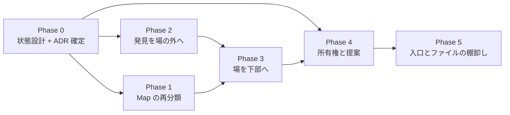

# 実装順序 (IA 再設計 段階「引き継ぎ」)

設計の逆順ではなく**土台から**。良いゾーン分割は良い開発分割になるので、
独立性の高いゾーンは後回しにできる。

正本の所在:

- **配置とその根拠** → `easy-extrude-wireframe-v8.html` の注釈①〜⑧ (最新版)
- **住所の物差しと却下した物差し** → `02-grouping-criteria.md`
- **設計判断** → **ADR-103** (Map の再分類) / **ADR-104** (所有権・提案・証憑)
- **状態と基数** → `docs/STATE_LEDGER.md` §提案中の実体

ここには**順序と、各段の完了条件**だけを置く (§1.1 — 複製しない)。

---

## Phase 0 — 状態を先に設計する (コードより前)

核 §1.4 の閾値を既に跨いでいる (提案・議題がそれぞれ 3 状態)。**クラスを書く前に**:

- [x] `docs/STATE_TRANSITIONS.md` に **提案** (`提案 → 承認 / 取り下げ`) と
      **議題** (`議題 → 決着 / 未決のまま閉会`) の節を起こす。guard と禁止遷移を列挙。
- [x] ADR-104 の**未解決 4 点**を決める → ADR-104 §未解決 4 点の決着 (U1〜U4)。
      **#1 は yes** (承認 = 主張更新 + 証憑記録の 1 undoable command)、#2 は楽観ロック
      guard で併存、#3 は新議題 + `supersedes`、#4 は記録時点の鍵集合を焼き込む。
- [x] ADR-103 / ADR-104 を Accepted へ。

**完了条件: 達成。** 不正状態が型で表現不能になる設計が図で描けている
(`stale` を状態にしない・`decidedBy ⊆ 決定時点の鍵集合`・終端からの復帰なし)。

## Phase 1 — Map の再分類 (ADR-103)

他のどの段にも依存しない**独立した削除**なので、最初に片付けると以降の見通しが良くなる。

- [x] `MapModeController.state.active` の撤去 → `PlaceToolController` へ再分類。
      描画状態 (`idle` / `drawing`) はツール状態として残った。
- [x] Lynch 5 種を `+ 追加` の **Place** グループへ。ヘッダの Map ボタンと Map ツールバー
      (`left:188px`) を削除。pan / wheel / pinch は OrbitControls へ返した。
- [x] 投影方式 (正射 / 透視) をギズモ直下のトグルへ。向きの入口はギズモのまま (足さない)。
      正射カメラは透視カメラからの**毎フレーム導出**にした (状態を持たない)。
- [x] 随伴更新: `STATE_LEDGER` (行の入れ替え + 負債 #1 と #3 を閉じる) /
      `STATE_TRANSITIONS` §Top-level Modes・§Place tool・§Projection /
      `SCREEN_DESIGN` S-14〜S-16 / `LAYOUT_DESIGN` / `CODE_CONTRACTS` 4 行 / `NAVIGATION`。

**完了条件: 達成。** トップレベルモードは 2 値で、`edit` かつ正射で真上から見られる
(e2e「正射のまま Edit Mode に入れる」が焼いている)。

## Phase 2 — 発見を場の外へ (最小で効果が最大)

現行の循環依存 (**場に入らないと場に入る必要があるかが分からない**) を断つ段。
権限も提案も要らないので、Phase 3 以降と独立に出荷できる。

- [ ] ヘッダに 3 カウンタ (`≈ 衝突` / `⚑ 議題` / `◇ 未所有`)。衝突は**導出値**なので保存しない。
- [ ] シーンスコープの KPI を 3D ビュー左上の HUD へ。**0 件は宣言**する
      (「✓ 全部パス」は嘘、消すのは #15 違反 — 原則 #31)。
- [ ] エンティティスコープの検証 (リーチ / 干渉 / 把持候補) を右パネル (選択物の隣) へ。
      = `置く → 届くか見る → 置き直す` のループを閉じる。

**完了条件:** Context 文書を読み込まなくても「未解決があるか」が分かる。
`Grasp Search` が `Robot` を選んだ状態から 1 クリックで届く。

## Phase 3 — 場を下部へ / 右ドックの奪い合いを解く

- [ ] `ContextLayer` の 10 タブを解体し、**議題 (衝突 ∪ 提案)** を下部展開パネルへ。
      表は横長なので器の形が合う。3D を覆わない (空間量は空間で検算する)。
- [ ] N Panel と右ドックの排他を解消 (`_updateGizmoOffset` の `+280` 項が消える)。
- [ ] 入力系タブ (Wizard / Assets / Intake) は「置く」側へ移すか、別の入口へ。
      特に **Assets は架台・コンベア・セル床を作る = モデリング**なので `+ 追加` が住所。

**完了条件:** 右端の常設は N Panel だけになり、全ゾーンの責務が一言で言える。

## Phase 4 — 所有権と提案 (ADR-104)

ここまでの土台の上に載る。**Phase 0 の #1 が未決のまま着手しない。**

- [ ] 鍵の集合 (`0..N`)。**モードにしない** (択一ではなく集合)。0 を既定値で埋めない。
- [ ] 実体ごとの所有者。**未宣言の 0 を数えて警告**、正当な 0 は宣言させる。
- [ ] 3 状態 (直接編集可 / 直接編集不可・提案可 / —) を**型で**表す。フラグの散乱にしない。
- [ ] 提案は差分 (現在値 → 希望値 + 理由) を運ぶ。理由は `Decision.rationale` へ。
- [ ] 承認は所有者の鍵を持つ人だけ。**無効時は理由を出す** (同じ述語の返り値から — 原則 #11)。
      衝突の解消は関与全員 (既存の n-ary 合同確定と同形)。
- [ ] 3D ドラッグからの主張書き換え (`createEditAdmissibleCommand`) を**モードの外へ出す**。

**完了条件:** 鍵ゼロの状態で他人のものを触ると提案になり、証憑が読める形で残る。
鍵を全部持つと単独決定になり証憑は増えない (正しい姿)。

## Phase 5 — 残りの棚卸し

- [ ] 入口の 4 重導線 (Home / Template Gallery / Wizard / Tour) を 1 本へ (機能 43〜47)。
- [ ] ファイル系の整理 (Export/Import / Save/Load / Context 入出力 — 機能 38〜42)。

---

## 依存関係

Phase 1 と Phase 2 は**互いに独立**なので並行して出せる。
Phase 4 は Phase 3 の器 (下部の場) が無いと提案の行き先が無い。
